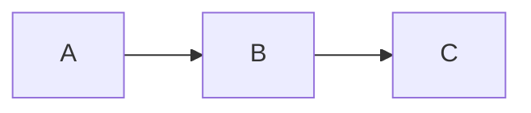

# Carbon for Marp

A [Marp](https://marp.app) theme based on the [IBM Carbon Design System](https://carbondesignsystem.com/).

## Preview

[examples/deck.pdf](examples/deck.pdf), full example deck as PDF (12 slides, light and dark variants, Mermaid diagrams).

## Quick start

A fresh deck folder with full theme support, including per-slide Mermaid light/dark theming, in three steps.

**1. Install in a new folder:**

```bash
mkdir pitch-deck && cd pitch-deck
npm init -y
npm install github:msradam/marp-carbon @marp-team/marp-cli mermaid
```

**2. Drop in `.marprc.js`:**

```js
const path = require('path');
const engine = require.resolve('marp-carbon');
const root = path.dirname(path.dirname(engine));
module.exports = {
  engine,
  themeSet: [path.join(root, 'themes')],
  html: true,
  allowLocalFiles: true,
};
```

**3. Write `deck.md`:**

````markdown
---
marp: true
theme: carbon
paginate: true
---

# Hello

---


````

Render:

```bash
npx marp --config .marprc.js deck.md -o deck.pdf
# or -o deck.html / deck.pptx
```

Per-slide Mermaid palette switching works out of the box because this package ships a custom Marp engine that re-themes each diagram based on the slide's class (`dark`, `invert`, etc.).

## Light install (theme only, no Mermaid theming)

If you don't want a `node_modules/` folder in your deck directory, save just the CSS to a central location:

```bash
mkdir -p ~/.marp/themes
curl -sL https://raw.githubusercontent.com/msradam/marp-carbon/main/themes/carbon.css      -o ~/.marp/themes/carbon.css
curl -sL https://raw.githubusercontent.com/msradam/marp-carbon/main/themes/carbon-dark.css -o ~/.marp/themes/carbon-dark.css
```

Render with the CSS directly:

```bash
marp --theme ~/.marp/themes/carbon.css deck.md -o deck.pdf
```

Mermaid blocks still render but with default colors instead of theme-aware ones. For full theming, use the Quick start above.

### VS Code live preview

Install [Marp for VS Code](https://marketplace.visualstudio.com/items?itemName=marp-team.marp-vscode). Open your user settings JSON (`Cmd/Ctrl+Shift+P`, then `Preferences: Open User Settings (JSON)`) and add:

```json
{
  "markdown.marp.themes": [
    "/Users/YOU/.marp/themes/carbon.css",
    "/Users/YOU/.marp/themes/carbon-dark.css"
  ]
}
```

Replace `/Users/YOU` with the output of `echo "$HOME"`. Any `.md` with `marp: true` and `theme: carbon` in the front matter now previews with this theme. The VS Code extension uses its own engine and won't run the per-slide Mermaid theming, but it's ideal for writing and live preview. Use the Quick start CLI command for final exports.

## Per-slide variants

Apply with `<!-- _class: NAME -->` on a single slide, or `class:` in front matter for the whole deck. Classes can be combined (e.g. `dark split`).

| Class             | Effect                                              |
| ----------------- | --------------------------------------------------- |
| `lead`            | Title slide, oversized Plex Light h1                |
| `split`           | Two-column grid                                     |
| `invert` / `dark` | Flip to Carbon g100 dark tokens                     |
| `g10`             | Light tonal layer (gray-10 background)              |
| `g90`             | Dark tonal layer (gray-90 background)               |
| `white` / `light` | Force light tokens inside a `carbon-dark` deck      |

```markdown
<!-- _class: lead -->
# Carbon **for Marp**

---

<!-- _class: dark split -->
## Dark side-by-side
```

## Customizing colors

Every color is a CSS custom property. Override with the `style:` directive:

```yaml
---
marp: true
theme: carbon
style: |
  section {
    --carbon-accent: #8a3ffc;
    --carbon-bg: #f4f4f4;
    --carbon-font-sans: 'Inter', sans-serif;
  }
---
```

### Tokens

| Token                       | Purpose                              |
| --------------------------- | ------------------------------------ |
| `--carbon-bg`               | Slide background                     |
| `--carbon-layer`            | Inline code, table header surface    |
| `--carbon-layer-accent`     | Deeper layer                         |
| `--carbon-border`           | Subtle borders                       |
| `--carbon-border-strong`    | Strong borders                       |
| `--carbon-text`             | Primary text                         |
| `--carbon-text-secondary`   | Secondary text, captions             |
| `--carbon-text-helper`      | Page numbers, header, footer         |
| `--carbon-accent`           | Brand accent (IBM blue)              |
| `--carbon-link`             | Link color                           |
| `--carbon-error`, `--carbon-success`, `--carbon-warning`, `--carbon-info` | Support colors |
| `--carbon-code-bg`          | Code block background                |
| `--carbon-code-keyword`, `--carbon-code-string`, `--carbon-code-comment`, `--carbon-code-number`, `--carbon-code-fn` | Syntax tokens |
| `--carbon-font-sans`, `--carbon-font-serif`, `--carbon-font-mono` | Font stacks |
| `--carbon-pad`              | Slide padding (default `64px`)       |
| `--carbon-rule`             | Left accent rule thickness           |

## Color reference

Pulled from `@carbon/colors`:

- **white**: bg `#ffffff`, text `#161616`, accent `#0f62fe` (blue-60), layer `#f4f4f4`
- **g10**: bg `#f4f4f4`, text `#161616`, layer `#ffffff`
- **g90**: bg `#262626`, text `#f4f4f4`, accent `#4589ff` (blue-50), layer `#393939`
- **g100**: bg `#161616`, text `#f4f4f4`, accent `#4589ff`, layer `#262626`

## What's in the box

- IBM Plex Sans, Serif, and Mono (loaded from Google Fonts)
- Carbon color tokens for the four Carbon themes: `white`, `g10`, `g90`, `g100`
- Light default (`carbon`) and dark default (`carbon-dark`)
- Heading scale tuned for 16:9 1280x720 slides
- Code blocks with a Carbon-flavored highlight.js token map
- Tables, blockquotes, lists, header, footer, pagination

## Feature support

| Feature                                  | Status | Notes                                               |
| ---------------------------------------- | :----: | --------------------------------------------------- |
| Headings, paragraphs, nested lists       |   Yes  |                                                     |
| Bold, italic, links                      |   Yes  |                                                     |
| Tables                                   |   Yes  |                                                     |
| Inline `code` and fenced blocks          |   Yes  | highlight.js token map                              |
| Blockquotes                              |   Yes  | Plex Serif                                          |
| Header, footer, pagination               |   Yes  |                                                     |
| `color:` and `backgroundColor:` directives | Yes  |                                                     |
| Class variants (`lead`, `split`, `dark`, `g10`, `g90`) | Yes |                                            |
| Marp auto-scaling                        |   Yes  |                                                     |
| Background images (`![bg]`, `![bg left/right/fit/cover]`) | Yes | Handled by Marpit engine                  |
| Image filters (`blur`, `brightness`)     |   Yes  | Marpit engine                                       |
| KaTeX math (`math: katex`)               |   Yes  |                                                     |
| `<mark>` and `==highlight==`             |   Yes  |                                                     |
| Emoji                                    |   Yes  | Marp core                                           |
| Mermaid diagrams                         |   Yes  | Requires the bundled engine (`engine/index.js` via `.marprc.js`). Light and dark Carbon tokens applied per slide automatically. |
| Embedded video / iframes                 | Partial | Requires `--html`                                   |

## Files

```
themes/
  carbon.css        # main theme, light default
  carbon-dark.css   # dark default variant (self-contained, no local imports)
engine/
  index.js          # custom Marp engine: Mermaid fence renderer + per-slide theming
mermaid/
  index.js          # IBM Carbon token palette for Mermaid themeVariables
src/
  build.js          # generates themes/ from @carbon/themes and @carbon/colors
examples/
  deck.md           # demo deck source
  deck.html         # rendered HTML
  deck.pdf          # rendered PDF
  deck.pptx         # rendered PowerPoint
```

## Disclaimer

I work at IBM, but this is a personal project. It is **not** an official IBM product and is not endorsed by IBM or the Carbon team. For anything design-system related, the source of truth is the official Carbon site: https://carbondesignsystem.com/

The tokens, type scale, and color values here are taken from the public `@carbon/colors` and `@carbon/themes` packages, but this repo will drift from upstream Carbon over time. If you need an accurate, current reference, go to the official docs.

"IBM", "Carbon", and "IBM Plex" are trademarks of IBM.

## Credits

Persona illustrations in `examples/img/` by [Victoruler](https://www.flaticon.com/authors/victoruler) on [Flaticon](https://www.flaticon.com/).

## License

MIT. IBM Plex is licensed under the SIL Open Font License 1.1.
