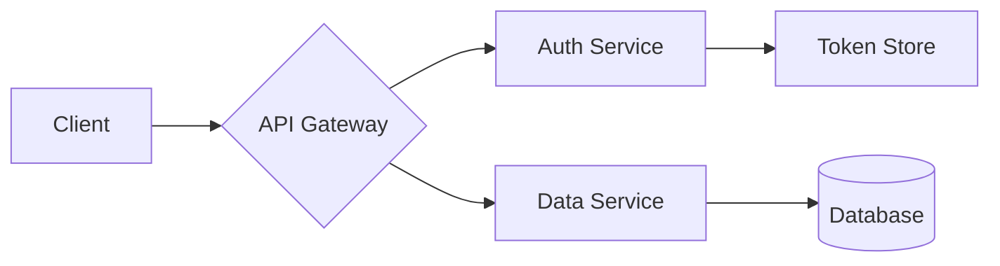
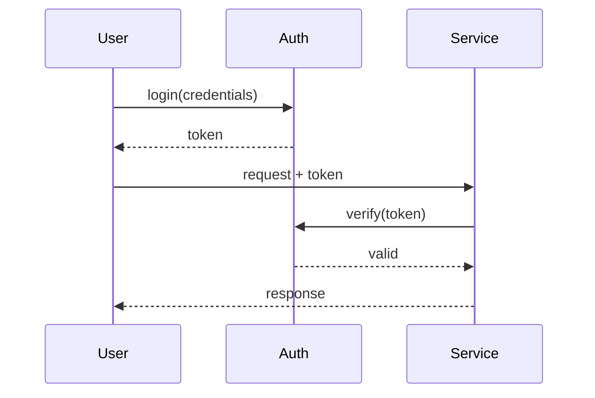

<!-- _class: lead -->
<!-- _footer: '' -->
<!-- _paginate: false -->

# Carbon **for Marp**

## A Marp theme based on the IBM Carbon Design System

---

###### Section 01

# What's in the box

- Carbon color tokens (white, g10, g90, g100)
- IBM Plex Sans, Serif, and Mono
- Light and dark variants
- Per-slide tonal overrides via `class:`
- CSS variable overrides for any color or font

---

## Typography

Headings use IBM Plex Sans Light (300) at large sizes and Regular (400) for body. Inline `code` and code blocks use IBM Plex Mono.

> Good design is good business.
> Thomas J. Watson Jr.

---

<!-- _class: split -->

## Two columns

Use `<!-- _class: split -->` to put the slide into a two-column grid. Headings span both columns.

- Carbon spacing scale
- 64px slide padding
- 4px accent rule on every slide

```python
def carbon(theme="white"):
    tokens = load(theme)
    return apply(tokens)

print(carbon("g100"))
```

---

<!-- _class: dark -->

## Dark mode (g100)

Set `<!-- _class: dark -->` on a slide, or use the `carbon-dark` theme for a dark deck by default. Tokens flip to the Carbon g100 palette.

```ts
type Theme = 'white' | 'g10' | 'g90' | 'g100';

const tokens: Record<Theme, Token[]> = load();
```

---

<!-- _class: g10 -->

## Tonal layers

`g10` is the light tonal layer: gray-10 background, white layers. Pair with `g90` on dark decks.

| Theme | Background | Text     |
| ----- | ---------- | -------- |
| white | `#ffffff`  | gray-100 |
| g10   | `#f4f4f4`  | gray-100 |
| g90   | `#262626`  | gray-10  |
| g100  | `#161616`  | gray-10  |

---

## Customizing

Override Carbon tokens via the `style:` directive:

```yaml
---
marp: true
theme: carbon
style: |
  section {
    --carbon-accent: #8a3ffc;
    --carbon-bg: #f4f4f4;
  }
---
```

---

## Nested lists and math

1. Carbon ships four themes
   - `white` and `g10` are light
   - `g90` and `g100` are dark
2. Each theme is a set of design tokens
3. Inline math: $E = mc^2$

$$
\int_{-\infty}^{\infty} e^{-x^2} \, dx = \sqrt{\pi}
$$

---

## Mermaid diagrams

Architecture and flow diagrams use IBM Carbon tokens automatically. Add `<!-- _class: dark -->` and the diagram palette flips to dark tokens.



---

<!-- _class: dark -->

## Mermaid on dark



---

###### Image embedding

## Three personas

  

Inline images sized with Marp's `![w:220]` directive. Adam, Antony, Clista, three users we design for.

- ``, width directive
- ``, explicit dimensions
- ``, natural size, capped to slide width

---

<!-- _class: lead -->
<!-- _paginate: false -->

# Thanks
